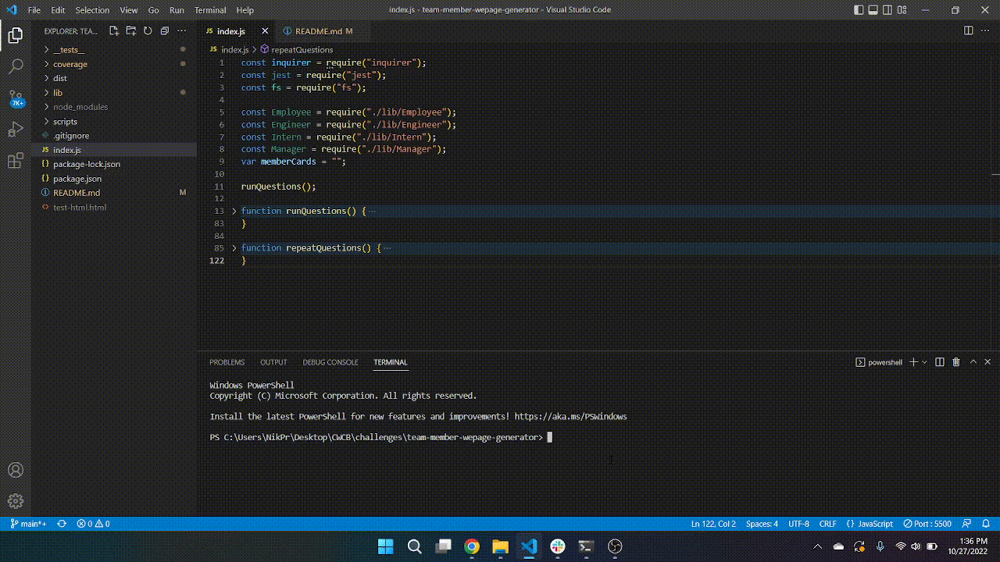
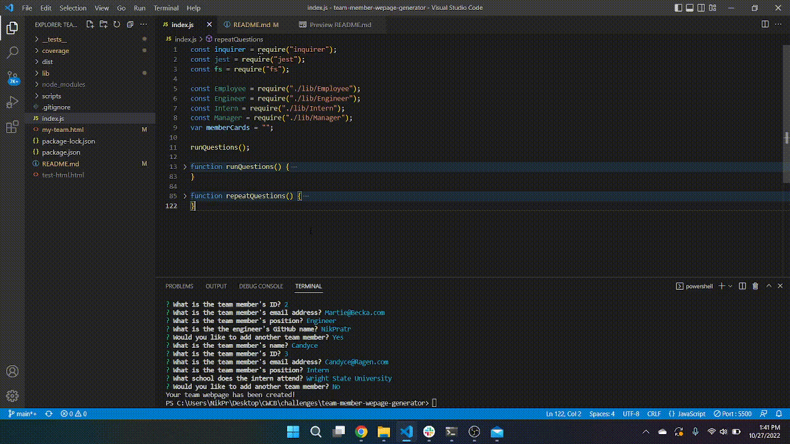
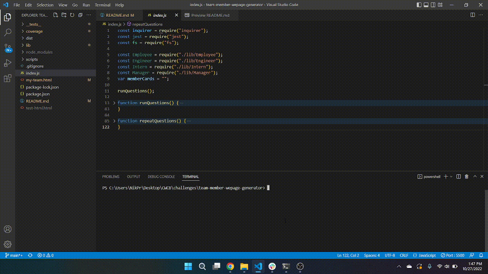

# team-member-webpage-generator

## This application takes information about employees via inquirer, and generates employee cards for them. Those employee cards are then appended to an html file that can display each of the cards.
 
<h3>The questions are asked through the command line, and can be looped through via a confirmation question. This is demonstrated below.</h3>
 

 
 
<h3>Below is a demonstration of the html page that is generated from the responses given.</h3>
 

 
 
<h3>Finally, there is a general class of employee, as well as extensions for a manager, engineer, and an intern. These include functionality which passes tests ran through jest. There is a demonstration of this below.</h3>
 
